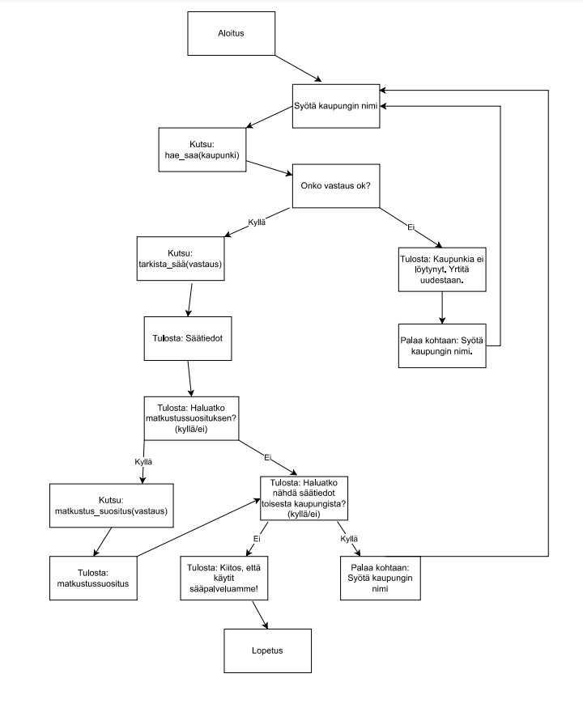

# Sääohjelma

<h3>Mistä ohjelmassa on kysymys? </h3>

Ohjelma hakee ja kertoo sään OpenWeatherMap sivun API:n avulla
käyttäjän syöttämän kaupungin perusteella. Se tarjoaa myös matkustussuosituksen näiden säätietojen perusteella.

<h3>Mitä se tekee? </h3>

Kysyy käyttäjältä kaupungin nimen, jonka jälkeen ohjelma hakee säätiedot kyseisestä kaupungista ja muotoilee ne käyttäjälle valmiiksi määritetyllä tavalla. Lisäksi ohjelma antaa käyttäjälle mahdollisuuden pyytää matkustussuositusta säätietojen perusteella. 

<h3>Miten aiotte sen toteuttaa? </h3>

Ohjelman toteutus tapahtuu käyttämällä Python-ohjelmointikieltä ja hyödyntämällä OpenWeatherMapin tarjoamaa API
säätietojen hakuun.

----------------------------------------------------------------------------------------------------

<h3>Miten käyttää/käynnistää? </h3>

1. Lataa "Sääohjelma koodi.py" tietokoneelle

2. Paina "Windows+R" avataksesi "Suorita"-ruudun. Kirjoita "cmd" ja napsauta sitten "OK" avataksesi tavallisen komentokehotteen. Vaihtoehtoisesti voit myös kirjoittaa "powershell", joka avaa Windows PowerShellin.

3. Jotta voit avata tiedosto cmd:ssä tai PowerShellissä sinun pitää siirtyä sen hakemistoon "cd"-komennolla ja kirjoittaa tiedoston nimi komentokehotteeseen. Esimerksiksi: "cd C:\Users\käyttäjänimi\Downloads" ja sen jälkeen kirjoittaa komento "python Sääohjelma koodi.py"

4. Nyt voit kirjoittaa kaupungin nimen ja ohjelma kertoo paikan sään, jonka jälkeen ohjelma kysyy haluatko matkasuosituksen, johon voi vastata "kyllä" tai "ei". Tämän jälkeen ohjelma kysyy haluatko uuden säätiedotuksen toisesta kaupungista, johon voi vastata "kyllä" tai "ei". Vastaamalla "kyllä" ohjelma aloittaa toiminnan alusta. Jos vastaa "ei" ohjelma lopettaa itsensä.

----------------------------------------------------------------------------------------------------

<h3>Toimintalogiikka vuokaavio </h3>

----------------------------------------------------------------------------------------------------

<h3>Demo ohjelmasta </h3>

<link>https://youtu.be/E8aR07q0nHc?si=1d1HzVArYfoSeubr</link>
